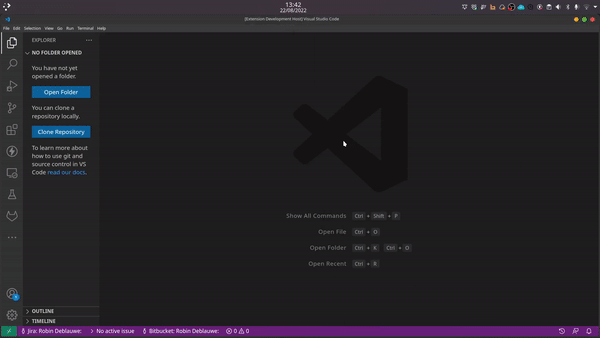

# angular-material-docs README

This extension allows to search the angular material documentation from inside vscode. It opens a webpage to the official documentation.

## Features

Search and open the official documentation of angular material quickly!

use `ctrl + shift + p` to open the command pallette, and search for `angular material docs`

